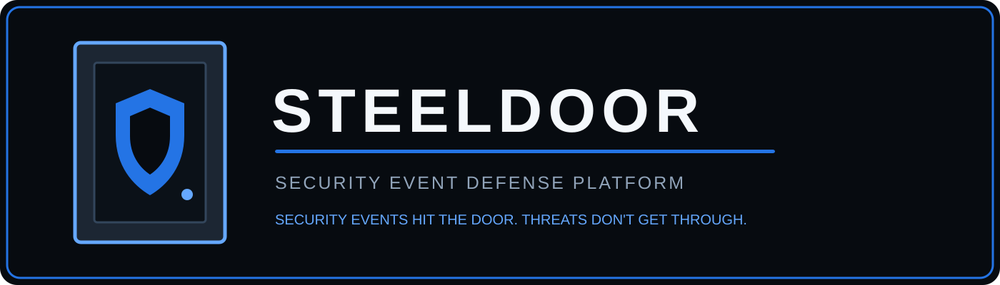

[](https://github.com/TYSECRD/DevSecOps-Portfolio/actions/workflows/ci.yml)

SteelDoor is a Python-based security-event monitoring and threat-detection API built to demonstrate secure application development, automated detection, authentication, rate limiting, security logging, database persistence, container security, automated testing, and DevSecOps pipeline controls.

---

## Current Features

* Ingest security events through a REST API
* Validate IPv4 and IPv6 source addresses
* Enforce approved severity levels
* Assign unique event IDs
* Record UTC timestamps
* Store security events in SQLite
* Retrieve recorded security events
* Filter events by severity
* Track event status through `new`, `investigating`, and `resolved`
* Detect repeated failed-login activity
* Detect brute-force behavior using a 5-attempt / 5-minute threshold
* Generate structured security alerts
* Ignore expired failed-login activity outside the detection window
* Reject malformed security data
* Interactive Swagger API documentation
* API-key authentication on protected endpoints
* Environment-based secret configuration
* Constant-time API-key comparison with `secrets.compare_digest()`
* Per-client API rate limiting
* `429 Too Many Requests` responses
* `Retry-After` response headers
* Security audit logging
* Invalid authentication-attempt logging
* Rate-limit violation logging
* Brute-force detection logging
* Docker containerization
* Non-root container execution
* Runtime secret injection
* Hardened Docker build context with `.dockerignore`
* Container vulnerability scanning with Docker Scout

---

## Security Architecture

Protected SteelDoor requests pass through multiple security controls before application logic is executed.

```text
Client Request
      |
      v
API-Key Authentication
      |
      v
Constant-Time Secret Validation
      |
      v
Client Rate Limiting
      |
      v
FastAPI Endpoint
      |
      v
Input Validation
      |
      v
Detection Engine
      |
      v
SQLite Persistence
      |
      +----> Security Logging
      |
      +----> Structured Alerts
```

SteelDoor applies defense-in-depth rather than relying on a single security control.

---

## Authentication

Protected endpoints require an API key supplied through the HTTP header:

```text
X-API-Key
```

SteelDoor does not hardcode its runtime API key in application source code.

The application reads the key from the environment variable:

```text
STEELDOOR_API_KEY
```

Authentication logic also rejects requests when the server-side secret is missing.

Secret values are compared using Python's:

```python
secrets.compare_digest()
```

This provides a safer comparison method for sensitive values.

Missing or invalid credentials return:

```text
401 Unauthorized
```

---

## Rate Limiting

SteelDoor includes an in-memory rate limiter to reduce excessive API requests.

Current policy:

```text
20 requests
per 60-second window
per client
```

When the limit is exceeded, SteelDoor returns:

```text
429 Too Many Requests
```

along with:

```text
Retry-After: 60
```

The rate limiter is intentionally lightweight for the current project stage. A distributed implementation could later use infrastructure such as Redis.

---

## Security Logging

SteelDoor includes a dedicated security logging module.

Security events currently logged include:

* Invalid or missing API-key attempts
* Rate-limit violations
* Brute-force detections

Logs include useful security context such as:

```text
timestamp
event type
client IP
security message
```

Example:

```text
timestamp=2026-09-02T22:46:10+00:00 event=invalid_api_key client_ip=127.0.0.1 message=Invalid or missing API key
```

Automated tests verify that security logging is actually triggered.

---

## Detection Engine

SteelDoor includes a dedicated detection module for analyzing security-event activity.

The first implemented detection rule identifies potential brute-force authentication attacks.

### Brute-Force Rule

SteelDoor generates an alert when:

* The same source IP generates at least 5 failed-login events
* Those events occur within a 5-minute window

Activity outside the detection window is excluded from the threshold.

```text
Failed login
     |
Failed login
     |
Failed login
     |
Failed login
     |
Failed login
     |
     v
SteelDoor Detection Engine
     |
     v
BRUTE_FORCE_ATTEMPT
Severity: HIGH
```

---

## Structured Alerts

When the brute-force rule is triggered, SteelDoor generates a structured alert.

```json
{
  "rule": "BRUTE_FORCE_ATTEMPT",
  "source_ip": "10.10.10.50",
  "severity": "high",
  "message": "Possible brute-force attack detected"
}
```

This separates raw security-event ingestion from detection results.

---

## DevSecOps Controls

Every push to GitHub automatically runs:

* Pytest automated testing
* Bandit static application security testing (SAST)
* Pip-audit dependency vulnerability scanning
* GitHub Actions continuous integration

The automated test suite currently contains:

```text
15 passing tests
```

Coverage includes:

* Health endpoint behavior
* Application information
* API greeting
* Event ingestion
* Event retrieval
* Severity validation
* IP-address validation
* Severity filtering
* Event status updates
* Brute-force detection
* Detection thresholds
* Detection-window expiration
* Missing API-key rejection
* Invalid API-key rejection
* Rate-limit enforcement
* `Retry-After` behavior
* Security logging

---

## Container Security

SteelDoor is packaged as a Docker image using:

```text
python:3.13-slim
```

The container is hardened to run as a dedicated non-root Linux user:

```text
steeldoor
```

Runtime verification:

```bash
docker exec steeldoor whoami
```

Expected result:

```text
steeldoor
```

This reduces the potential impact of an application compromise inside the container.

The Docker build context also excludes unnecessary or sensitive files through `.dockerignore`, including:

```text
__pycache__
*.pyc
.pytest_cache
.git
.github
steeldoor.db
.env
```

---

## Container Vulnerability Scanning

SteelDoor was analyzed with Docker Scout.

The first container scan identified:

```text
0 Critical
3 High
2 Medium
24 Low
```

Investigation determined that the three High-severity findings were associated with unnecessary package-management tooling bundled inside the runtime image.

Because SteelDoor does not require `pip` after dependency installation, the runtime image was hardened by removing it after the build dependencies were installed.

After rebuilding the image and performing a fresh scan:

```text
CRITICAL  0
HIGH      0
MEDIUM    0
LOW       0
```

Docker Scout reported:

```text
No vulnerable packages detected
```

This demonstrates a complete vulnerability-management workflow:

```text
Build
  |
  v
Scan
  |
  v
Identify Vulnerabilities
  |
  v
Investigate Root Cause
  |
  v
Reduce Attack Surface
  |
  v
Rebuild
  |
  v
Rescan
  |
  v
0 Detected Vulnerabilities
```

---

## Technology Stack

* Python 3.13
* FastAPI
* Pydantic
* SQLite
* Pytest
* GitHub Actions
* Bandit
* Pip-audit
* Docker
* Docker Desktop / WSL 2
* Docker Scout

---

## API Endpoints

| Method  | Endpoint                        | Purpose                                       | Authentication |
| ------- | ------------------------------- | --------------------------------------------- | -------------- |
| `GET`   | `/health`                       | Verify service health                         | Public         |
| `GET`   | `/api/info`                     | Return application information                | Public         |
| `GET`   | `/api/greet`                    | Return a basic API greeting                   | Public         |
| `POST`  | `/api/events`                   | Validate, store, and analyze a security event | API Key        |
| `GET`   | `/api/events`                   | Retrieve security events                      | API Key        |
| `GET`   | `/api/events?severity=critical` | Filter events by severity                     | API Key        |
| `PATCH` | `/api/events/{event_id}`        | Update investigation status                   | API Key        |

---

## Example Security Event

```json
{
  "source_ip": "10.0.0.77",
  "event_type": "failed_login",
  "severity": "high",
  "description": "Authentication failure detected"
}
```

After ingestion, SteelDoor stores the event and evaluates activity from the source IP against its detection rules.

---

## Run SteelDoor Locally

Install dependencies:

```bash
python -m pip install -r requirements.txt
```

Set the API key.

PowerShell:

```powershell
$env:STEELDOOR_API_KEY="your-local-api-key"
```

Start the API:

```bash
python -m uvicorn app.main:app --reload
```

Open:

```text
http://127.0.0.1:8000/docs
```

Health endpoint:

```text
http://127.0.0.1:8000/health
```

---

## Run SteelDoor with Docker

Build the Docker image:

```bash
docker build -t steeldoor .
```

Run the container:

```bash
docker run --rm -d \
  --name steeldoor \
  -p 8000:8000 \
  -e STEELDOOR_API_KEY=your-api-key \
  steeldoor
```

PowerShell users can run the command on one line:

```powershell
docker run --rm -d --name steeldoor -p 8000:8000 -e STEELDOOR_API_KEY=your-api-key steeldoor
```

Verify the container:

```bash
docker ps
```

Verify non-root execution:

```bash
docker exec steeldoor whoami
```

Expected result:

```text
steeldoor
```

Open Swagger:

```text
http://localhost:8000/docs
```

Open the health endpoint:

```text
http://localhost:8000/health
```

Stop SteelDoor:

```bash
docker stop steeldoor
```

---

## Scan the Docker Image

Run a vulnerability overview:

```bash
docker scout quickview steeldoor
```

Scan for Critical and High vulnerabilities:

```bash
docker scout cves local://steeldoor --only-severity critical,high
```

---

## Run the Tests

```bash
python -m pytest -v
```

Current result:

```text
15 passed
```

---

## Project Structure

```text
DevSecOps-Portfolio/
|
|-- .github/
|   `-- workflows/
|       `-- ci.yml
|
|-- app/
|   |-- database.py
|   |-- detection.py
|   |-- main.py
|   |-- rate_limit.py
|   `-- security_logger.py
|
|-- tests/
|   `-- test_main.py
|
|-- assets/
|   `-- steeldoor-banner.svg
|
|-- .dockerignore
|-- .gitignore
|-- Dockerfile
|-- README.md
`-- requirements.txt
```

---

## Security Controls Implemented

| Control                            | Status |
| ---------------------------------- | ------ |
| Input validation                   | ✅      |
| IPv4 / IPv6 validation             | ✅      |
| Severity enforcement               | ✅      |
| API-key authentication             | ✅      |
| Environment-based secrets          | ✅      |
| Constant-time secret comparison    | ✅      |
| Missing credential rejection       | ✅      |
| Invalid credential rejection       | ✅      |
| API rate limiting                  | ✅      |
| `Retry-After` responses            | ✅      |
| Security logging                   | ✅      |
| Brute-force detection              | ✅      |
| Automated tests                    | ✅      |
| SAST with Bandit                   | ✅      |
| Dependency scanning with Pip-audit | ✅      |
| Docker containerization            | ✅      |
| Non-root container execution       | ✅      |
| Docker vulnerability scanning      | ✅      |
| GitHub Actions CI                  | ✅      |

---

## Roadmap

### SteelDoor v1

* [x] Security-event REST API
* [x] SQLite persistence
* [x] Event validation
* [x] Brute-force detection
* [x] Structured security alerts
* [x] API-key authentication
* [x] Environment-based secrets
* [x] API rate limiting
* [x] Structured security logging
* [x] Docker containerization
* [x] Non-root container execution
* [x] Container vulnerability scanning
* [ ] Additional application metrics
* [ ] Readiness/database health checks
* [ ] Container security scanning in CI/CD
* [ ] Secret scanning
* [ ] Cloud deployment
* [ ] Final architecture documentation

### Future Expansion

* Additional detection rules
* Persistent alert storage
* Alert-management endpoints
* Pagination and advanced event filtering
* PostgreSQL support
* Prometheus-compatible metrics
* Monitoring and observability
* Infrastructure as Code
* Cloud IAM and secrets management
* Expanded CI/CD security gates

---

## Project Status

SteelDoor is under active development as a hands-on DevSecOps portfolio project focused on building, securing, testing, containerizing, scanning, and deploying a production-style security application.

The project is designed to demonstrate not only application development, but the complete DevSecOps lifecycle:

```text
Develop
   |
   v
Test
   |
   v
Secure
   |
   v
Containerize
   |
   v
Scan
   |
   v
Harden
   |
   v
Automate
   |
   v
Deploy
   |
   v
Monitor
```
